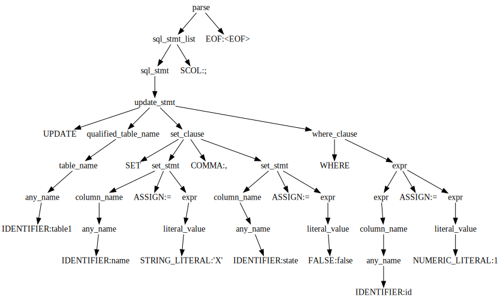
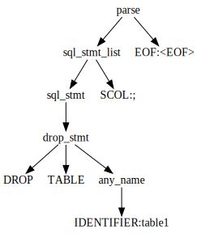

# ParallelDB

## In memory database with parallelizing subqueries.

### Frontend: https://paralleldb.vercel.app/

### Backend: https://xd3yqahwskuxffslvniwhoxbvy0xuyrv.lambda-url.eu-central-1.on.aws/

### Backend swagger https://xd3yqahwskuxffslvniwhoxbvy0xuyrv.lambda-url.eu-central-1.on.aws/swagger/index.html

### Frontend: Vue3 + Typescript (hosted on vercel)

### Backend: C# + ASP.Net (hosted on aws lambda)

## Usage example

### <ins>CREATE TABLE Statement:</ins>

``` sql
CREATE TABLE IF NOT EXISTS table1 (
    id int DEFAULT 1,
    name TEXT NOT NULL,
    state boolean NOT NULL DEFAULT true
);
```
``` sql
CREATE TABLE IF NOT EXISTS table2 (
    id int DEFAULT 1,
    name TEXT NOT NULL,
    state boolean NOT NULL DEFAULT true
);
```
### Syntax tree for table1:


### <ins>INSERT TABLE Statement</ins>
``` sql
INSERT INTO table1 (id, name, state) 
VALUES (1, 'A', true), (2, 'B', false), 
       (3, 'C', true), (4, 'D', false);
```

``` sql
INSERT INTO table2 (id, name, state) 
VALUES (1, 'A', true), (2, 'B', true), 
       (3, 'C', true), (4, 'D', true);
```
### Syntax tree for table1:

### Query tree for table1:

### <ins>SELECT TABLE Statement</ins>
``` sql
SELECT * FROM table1 WHERE state = true LIMIT 1;
```
### Result:
| id           | name      | state      |
|--------------|-----------|------------|
| 1            | A         | true       |
### Syntax tree:

### Query tree:

``` sql
SELECT name FROM table1 EXCEPT SELECT * FROM table2;
```
### Result:
| name         |
|--------------|
| B            |
| D            |
### Syntax tree:

### Query tree:


``` sql
SELECT * FROM (SELECT * FROM table1), (SELECT * FROM table2);
```
### Result:
| id           | name      | state      | id         | name       | state      |
|--------------|-----------|------------|------------|------------|------------|
| 1 | A | true  | 1       | A        | true        |
| 1 | A | true | 2        | B        | true       |
| 1 | A | true | 3        | C        | true       |
| 1 | A | true | 4        | D        | true        |
| 2 | B | false | 1        | A        | true       |
| 2 | B | false | 2        | B       | true       |
| 2 | B | false | 3        | C        | true       |
| 2 | B | false | 4        | D        | true       |
| 3 | C | true | 1        | A        | true       |
| 3 | C | true | 2        | B        | true       |
| 3 | C | true | 3        | C        | true       |
| 3 | C | true | 4        | D        | true       |
| 4 | D | false | 1        | A        | true       |
| 4 | D | false | 2        | B        | true       |
| 4 | D | false | 3        | C        | true       |
| 4 | D | false | 4        | D        | true       |
### Syntax tree:

### Query tree:

### <ins>UPDATE TABLE Statement</ins>
``` sql
UPDATE table1 SET name = 'X', state = false WHERE id = 1;
```
### Result:
| id           | name      | state      |
|--------------|-----------|------------|
| 1            | X         | false      |
| 2            | B         | false      |
| 3            | C         | true       |
| 4            | D         | false      |
### Syntax tree for table1:

### Query tree for table1:

### <ins>DELETE TABLE Statement</ins>
``` sql
DELETE FROM table1 WHERE state = false;
```
### Result:
| id           | name      | state      |
|--------------|-----------|------------|
| 3            | C         | true       |
### Syntax tree for table1:

### Query tree for table1:

### <ins>DROP TABLE Statement</ins>

``` sql
DROP TABLE table1;
```

### Syntax tree for table1:
